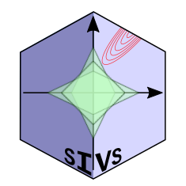

#  Stable Iterative Variable Selection (SIVS) 

SIVS is an acronym of Stable Iterative Variable Selection, and as the name suggests is a feature selection method that is robust to the variations that cross-validation can have on various methods with embedded feature selection. This method hired an iterative approach and  internally utilizes varius Machine Learning methods which have embedded feature reduction in order to shrink down the feature space into a small and yet robust set.

For citation information, see the [citation section](#citation) of this document.


## Installation

You can download and install the latest stable version from CRAN via:

```r
install.packages("sivs", repos = "https://cran.rstudio.com")
```

Alternatively, you can install it directly from github via either of the following:

```r
### First Approach
if (!require("devtools")) install.packages("devtools")
devtools::install_github("mmahmoudian/sivs")
```

```r
### Second Approach
if (!require("remotes")) install.packages("remotes")
remotes::install_github('mmahmoudian/sivs')
```


## Citation

This method has been published in the journal of Bioinformatics:

Mehrad Mahmoudian, Mikko S Venäläinen, Riku Klén, Laura L Elo, Stable Iterative Variable Selection, Bioinformatics, 2021;, btab501, https://doi.org/10.1093/bioinformatics/btab501

BibTeX entry for LaTeX users:

```
@article{10.1093/bioinformatics/btab501,
    author = {Mahmoudian, Mehrad and Venäläinen, Mikko S and Klén, Riku and Elo, Laura L},
    title = "{Stable Iterative Variable Selection}",
    journal = {Bioinformatics},
    year = {2021},
    month = {07},
    abstract = "{The emergence of datasets with tens of thousands of features, such as high-throughput omics biomedical data, highlights the importance of reducing the feature space into a distilled subset that can truly capture the signal for research and industry by aiding in finding more effective biomarkers for the question in hand. A good feature set also facilitates building robust predictive models with improved interpretability and convergence of the applied method due to the smaller feature space.Here, we present a robust feature selection method named Stable Iterative Variable Selection (SIVS) and assess its performance over both omics and clinical data types. As a performance assessment metric, we compared the number and goodness of the selected feature using SIVS to those selected by LASSO regression. The results suggested that the feature space selected by SIVS was, on average, 41\\% smaller, without having a negative effect on the model performance. A similar result was observed for comparison with Boruta and Caret RFE.The method is implemented as an R package under GNU General Public License v3.0 and is accessible via Comprehensive R Archive Network (CRAN) via https://cran.r-project.org/web/packages/sivs/index.html or through Github via https://github.com/mmahmoudian/sivs/Supplementary data are available at Bioinformatics online.}",
    issn = {1367-4803},
    doi = {10.1093/bioinformatics/btab501},
    url = {https://doi.org/10.1093/bioinformatics/btab501},
    note = {btab501},
    eprint = {https://academic.oup.com/bioinformatics/advance-article-pdf/doi/10.1093/bioinformatics/btab501/39070854/btab501.pdf},
}
```
